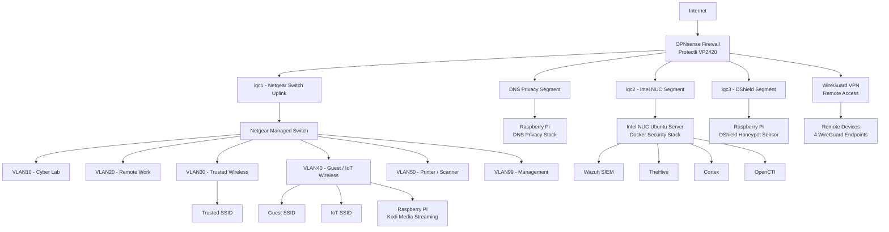
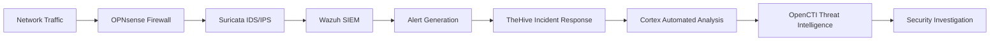

# Cody J. Tilley

Cybersecurity professional focused on **network security, detection engineering, and offensive security research**.

## Certifications

---
I operate a segmented **cybersecurity lab environment** used for:
- penetration testing practice
- intrusion detection research
- network traffic analysis
- threat intelligence integration
- SIEM experimentation

My work focuses on understanding how attacks occur and building **defensive visibility to detect them**.

## Home Lab Topology

The lab is designed as a segmented enterprise-style network architecture centered around an OPNsense firewall, managed switching, dedicated infrastructure segments, and containerized security tooling.

---
## Lab Capabilities

This environment supports hands-on experimentation with:
- intrusion detection tuning
- SIEM alert correlation
- network traffic inspection
- adversary simulation
- threat intelligence enrichment
- firewall rule analysis
- DNS privacy infrastructure
- remote secure access via VPN

The architecture isolates lab, work, wireless, IoT, printer, and management networks while enabling controlled monitoring and telemetry collection.

## Security Stack

### Detection Pipeline

Security telemetry collected within the lab environment flows through the following monitoring and analysis pipeline.

---
### Firewall & Network Segmentation
- OPNsense Firewall (Protectli VP2420)
- VLAN segmentation with managed switching
- WireGuard VPN for secure remote access
- Suricata IDS/IPS
- ZenArmor traffic analysis

### Security Monitoring & Incident Response
- Wazuh SIEM
- TheHive incident response platform
- Cortex automated analysis engine

## Infrastrucure
- Ubuntu server running Docker security stack
- Intel NUC security host
- Raspberry Pi sensors and infrastructure services
- DNS privacy stack for internal resolution hardening
- DShield honeypot sensor

## Security Research & Projects

### Network Security Lab

A segmented cybersecurity lab environment built with **OPNsense firewall and VLAN isolation**.

Research areas include:
- IDS rule tuning
- firewall policy validation
- network traffic analysis
- SIEM event correlation
- detection engineering experimentation

---
### Security Research & Lab Writeups

Documenting security research and lab exercises including:
- penetration testing labs
- network security experiments
- vulnerability analysis
- detection engineering techniques

Research notes and walkthroughs are published at:

[Walkthroughs](https://cta0930.github.io)

---
# Professional Links

### LinkedIn  

All Links  
[Linktr](https://linktr.ee/cta0930)

---
## Repository Focus

This GitHub will continue to grow with:

- security research
- lab infrastructure projects
- penetration testing tooling
- detection engineering experiments
- security walkthroughs

---
### **TryHackMe Progress**

---
### ***Join me on CTFs and labs***

---

